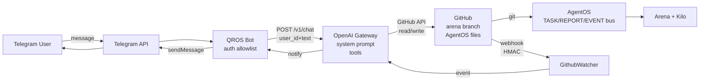
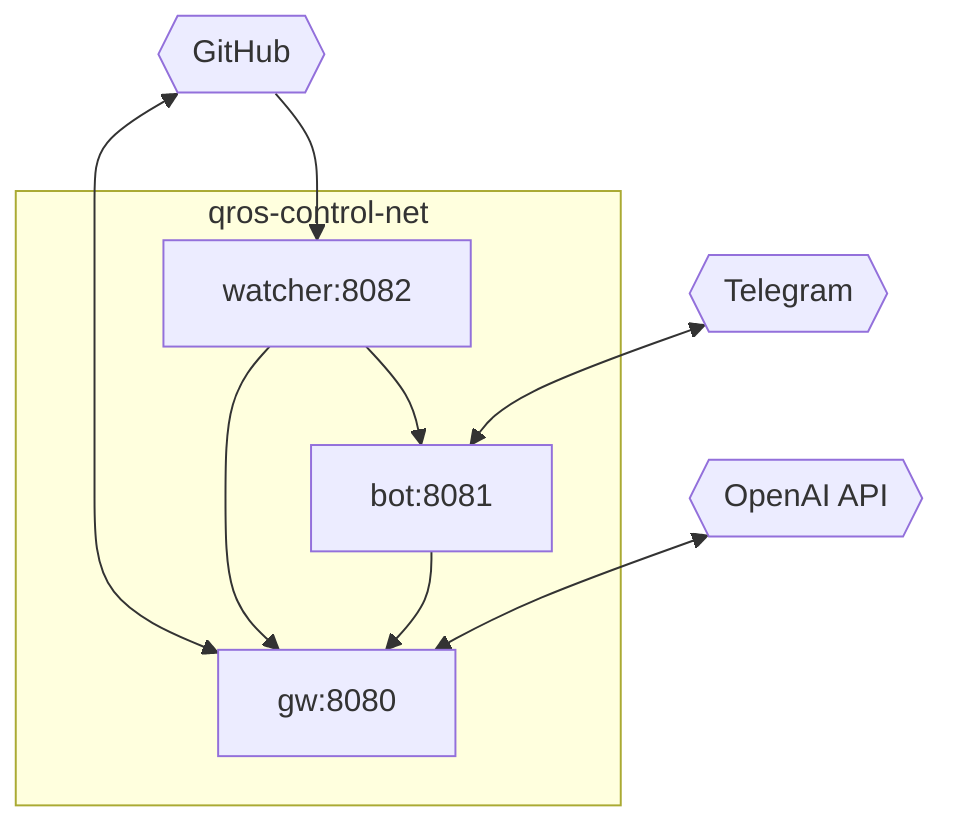

# QROS Control Center v1 — Architecture (Stage 1)

> **Stage 1: project structure only — no business logic, no trading, no AI. All code is stubs with `/health` endpoints; see each service README.**

## 0. Purpose
Remote project management for **QuantResearchOS** (CandleBreakoutEA research OS). Not trading. Not AI advice. The Control Center lets the owner, from Telegram, inspect and (Stage 2) manage `AgentOS` state via `GitHub` as the source of truth, from anywhere.

---

## 1. Pipeline
```
Telegram
  ↓  (Bot API, polling or webhook, allowlist auth)
QROS Bot  — ControlCenter/Bot  (Python, python-telegram-bot, FastAPI /health)
  ↓  HTTP POST /v1/chat  (telegram_user_id + text + context)
OpenAI Gateway  — ControlCenter/Gateway  (FastAPI, OpenAI SDK stub)
  ↓  function tools → GitHub API (read: PROJECT_STATUS/TASK_QUEUE/etc; write Stage 2)
GitHub  — masudbek001-droid/QuantResearchOS  (arena branch, PRs, checks, webhooks)
  ↓  git is the bus; webhooks are notifications
AgentOS  — AgentOS/**  (TASK_QUEUE, REPORT_QUEUE, EVENT_BUS, LOCK_MANAGER — Git-native, single-owner)
  ↓  git pull
Arena + Kilo  — cloud workspace + local runner (downstream consumers of AgentOS state)
```

**Reverse (notifications):**
```
GitHub (push/PR/check) → GithubWatcher (HMAC) → Gateway → Bot → Telegram (notify)
```

**Key principle:** Bot never writes `AgentOS/**` directly. Gateway never writes local files. GitHub is the only writer; Watcher is read-only notification.

---

## 2. Components

### 2.1 Telegram
- User → Telegram Bot API. Owner's allowlisted user IDs only (deny-by-default).
- Bot token via `@BotFather`, stored in `TELEGRAM_BOT_TOKEN`.

### 2.2 QROS Bot (`ControlCenter/Bot`)
- **Runtime:** `python:3.11-slim`, `python-telegram-bot`, `FastAPI` for ops (`/health`, `/ready`).
- **Responsibility:** Auth at entry (check `TELEGRAM_ALLOWED_USER_IDS`), map Telegram message → Gateway `POST /v1/chat`, relay Gateway reply → Telegram. Never calls GitHub/AgentOS directly.
- **Stage 1 stub:** `src/main.py` exposes `GET /health`, `/ready`, `/`; `src/config.py` validates env; `src/handlers/` is skeleton. No polling, no Telegram network call.
- **Stage 2:** `Application` with long-polling (default) or webhook (`TELEGRAM_WEBHOOK_URL`), command handlers `/start /help /status /tasks /reports /events` all via Gateway.

### 2.3 OpenAI Gateway (`ControlCenter/Gateway`)
- **Runtime:** `FastAPI`, `openai` SDK (Stage 1: not instantiated).
- **Responsibility:** Only component that talks to OpenAI. Holds `SYSTEM_PROMPT_STAGE1` (remote project management, forbids trading/core mutation, mandates GitHub-as-bus). Defines `TOOLS_DESIGN` (read file, list tasks, create task, validate) — Stage 2 executes via GitHub API. Enforces per-user rate limit, audit (logs `telegram_user_id` + tool), caps tokens/temperature.
- **Stage 1 stub:** `GET /health`, `/ready`, `/v1/tools`, `POST /v1/chat` → `stub_handle` echo. No OpenAI call.
- **Full spec:** `ControlCenter/docs/OPENAI_GATEWAY_DESIGN.md`.

### 2.4 GitHub
- **Repo:** `masudbek001-droid/QuantResearchOS`, branch `arena/01a0a3b5-quantresearchos` (mission), `main` protected.
- **Source of truth:** `AgentOS/TASK_QUEUE.md`, `REPORT_QUEUE.md`, `EVENT_BUS.md`, etc. All mutations are Git commits via GitHub API (Stage 2). Bot/Gateway are stateless; Git is the bus.
- **Webhook:** `POST https://<public>/github/webhook` → GithubWatcher, HMAC `GITHUB_WEBHOOK_SECRET`.

### 2.5 GithubWatcher (`ControlCenter/GithubWatcher`)
- **Runtime:** `FastAPI`, HMAC verification in `src/webhook.py`.
- **Responsibility:** Verify `X-Hub-Signature-256` (`hmac.compare_digest`), dedup by `X-GitHub-Delivery` (Stage 2: Redis), route subscribed events to Gateway → Bot → Telegram.
- **Stage 1 stub:** `GET /health`, `/ready`, `POST /github/webhook` verifies and logs, no forward.
- **Subscribed events (design):** `push`, `pull_request`, `pull_request_review`, `check_suite`, `check_run`, `workflow_run`.
- **Full spec:** `ControlCenter/docs/GITHUB_WEBHOOK_DESIGN.md`.

### 2.6 AgentOS
- **Unmodified in Stage 1** (per mission). Remains Git-native, single-owner, 8-file bus. Control Center is a *client* of AgentOS via GitHub, not a replacement.
- See `AgentOS/AGENT_PROTOCOL.md`, `AgentOS/OWNERSHIP_MAP.md`.

### 2.7 Arena + Kilo
- **Arena:** cloud workspace where `arena/01a0a3b5-quantresearchos` lives (this repo).
- **Kilo:** local runner placeholder (Stage 1: env `KILO_URL`, no implementation). Future: pulls Arena state, runs builds/tests.

---

## 3. Deployment Topology (Stage 1)

### 3.1 Docker Compose
```
docker-compose.yml  (root, also at ControlCenter/docker-compose.yml)
  services:
    gateway          :8080  (depends_on: none)
    bot              :8081  (depends_on: gateway healthy)
    github-watcher   :8082  (depends_on: gateway healthy)
  network: qros-control-net (bridge)
  volume: qros-control-logs
```

Healthchecks: each service `GET /health` via `python urllib`. Restart `unless-stopped`. Env via `.env` + `env_file`.

### 3.2 Diagram — Request Flow


### 3.3 Diagram — Compose Network


---

## 4. Directory Layout
```
QuantResearchOS/
├── docker-compose.yml              # compose for qros Bot/Gateway/Watcher
├── .env.example                    # all env vars (also ENV.example)
├── ENV.example
├── ARCHITECTURE.md                 # this file (also ControlCenter/docs/ARCHITECTURE.md)
├── SECURITY.md
├── INSTALL.md
├── ControlCenter/                  # QROS Control Center v1 root
│   ├── README.md
│   ├── docker-compose.yml          # copy of root (standalone)
│   ├── .env.example
│   ├── config/env.example
│   ├── docs/
│   │   ├── ARCHITECTURE.md
│   │   ├── SECURITY.md
│   │   ├── INSTALL.md
│   │   ├── ENV_VARS.md
│   │   ├── GITHUB_WEBHOOK_DESIGN.md
│   │   ├── TELEGRAM_BOT_DESIGN.md
│   │   └── OPENAI_GATEWAY_DESIGN.md
│   ├── Bot/
│   │   ├── Dockerfile
│   │   ├── requirements.txt
│   │   ├── src/config.py          # BotSettings + allowlist
│   │   ├── src/main.py            # FastAPI stub /health /ready
│   │   ├── src/handlers/__init__.py  # command skeletons
│   │   └── README.md
│   ├── Gateway/
│   │   ├── Dockerfile
│   │   ├── requirements.txt
│   │   ├── src/config.py
│   │   ├── src/openai_client.py   # SYSTEM_PROMPT + tools design + stub_handle
│   │   ├── src/main.py            # FastAPI stub /v1/chat /v1/tools
│   │   └── README.md
│   ├── GithubWatcher/
│   │   ├── Dockerfile
│   │   ├── requirements.txt
│   │   ├── src/config.py
│   │   ├── src/webhook.py         # verify_signature + subscribed events
│   │   ├── src/main.py            # FastAPI stub /github/webhook
│   │   └── README.md
│   └── tests/
│       └── test_stage1_structure.py  # validates Stage 1 deliverables
├── AgentOS/                        # UNMODIFIED — Git-native bus (see AGENT_PROTOCOL.md)
└── 01_Source/EA/**                 # UNMODIFIED — trading core frozen (MIPS v1.0)
```

---

## 5. Environment Variables
Single source: `.env.example` (and `ENV.example`, `ControlCenter/.env.example`, `ControlCenter/config/env.example` — all copies). See `ControlCenter/docs/ENV_VARS.md`.

Required groups:
- **Telegram:** `TELEGRAM_BOT_TOKEN`, `TELEGRAM_ALLOWED_USER_IDS` (deny-by-default), `TELEGRAM_WEBHOOK_URL` (optional).
- **OpenAI:** `OPENAI_API_KEY`, `OPENAI_MODEL`, `OPENAI_BASE_URL`, limits.
- **GitHub:** `GITHUB_TOKEN` (minimal PAT), `GITHUB_REPO`, `GITHUB_WEBHOOK_SECRET`, `GITHUB_ARENA_BRANCH`.
- **Ports/network:** `BOT_PORT`, `GATEWAY_PORT`, `GITHUB_WEBHOOK_PORT`, `NETWORK_NAME`.

No secrets in code, no secrets in Git, compose uses `env_file: .env`.

---

## 6. Security Model (summary)
Full: `SECURITY.md` / `ControlCenter/docs/SECURITY.md`.
- Secrets only via env / secret manager, never committed.
- Telegram: allowlist enforced at Bot entry, all others dropped + logged; token never logged.
- GitHub webhook: HMAC `sha256` with `compare_digest`, 401 on failure, idempotency via `X-GitHub-Delivery`.
- GitHub token: minimal scopes (fine-grained PAT, repo-limited), never in logs.
- OpenAI key: only Gateway sees it, rate-limited, never forwarded to Bot/Watcher/Telegram.
- AgentOS invariant: only GitHub commits mutate `AgentOS/**`; no direct file writes from Bot/Gateway.
- Network: bridge `qros-control-net`, no privileged containers, non-root `appuser`, healthchecks, `unless-stopped`.

---

## 7. GitHub Webhook Design (summary)
Full: `ControlCenter/docs/GITHUB_WEBHOOK_DESIGN.md`.
- **Endpoint:** `POST /github/webhook` (Watcher).
- **Headers:** `X-Hub-Signature-256: sha256=<hmac>`, `X-GitHub-Event`, `X-GitHub-Delivery`.
- **Verification:** `hmac.new(secret, raw_body, sha256).hexdigest()` vs header, constant-time.
- **Subscribed:** `push`, `pull_request`, `check_suite`, `check_run`, `workflow_run` (design).
- **Idempotency:** `X-GitHub-Delivery` dedup (Stage 2: Redis 24h).
- **Routing (Stage 2):** `push` → cache invalidate, `pull_request/check_suite` → Gateway summary → Telegram notify.

---

## 8. Telegram Bot Design (summary)
Full: `ControlCenter/docs/TELEGRAM_BOT_DESIGN.md`.
- **Auth:** allowlist at handler entry; unauthorized → silent (or generic "not authorized") + audit log.
- **Commands (Stage 1 design, Stage 2 implements):** `/start`, `/help`, `/status` (PROJECT_STATUS via Gateway), `/tasks` (TASK_QUEUE), `/reports` (REPORT_QUEUE), `/events` (EVENT_BUS tail).
- **Transport:** Stage 1 FastAPI stub; Stage 2 `python-telegram-bot` long-polling (default) or webhook.
- **Forwarding:** every command → `Gateway POST /v1/chat` with `telegram_user_id`; Bot never calls GitHub.

---

## 9. OpenAI Gateway Design (summary)
Full: `ControlCenter/docs/OPENAI_GATEWAY_DESIGN.md`.
- **System prompt:** remote project management only; forbids trading/core mutation; mandates GitHub-as-bus.
- **Tools (design, Stage 2 wires):** `github_read_file`, `github_list_tasks`, `github_create_task`, `agentos_validate`.
- **Safety:** per-user rate limit (`GATEWAY_RATE_LIMIT_RPM`), token caps, HMAC-style audit (log user + tool, never key).
- **Stage 1 stub:** `POST /v1/chat` echoes; `GET /v1/tools` lists designed tools; no OpenAI call.

---

## 10. Stage 1 Non-Goals
- No business logic (no Telegram polling, no OpenAI call, no GitHub write, no PR creation).
- No mutation of `01_Source/EA/**` (trading frozen) or `AgentOS/**` (collaboration layer).
- No Arena/Kilo execution logic; `KILO_URL` is stub.
- No persistence (no Redis/Postgres required).

## 11. Stage 2 Preview (not implemented)
- Bot: register Application, handlers, allowlist + Gateway forward.
- Gateway: `openai.OpenAI()` + tool execution via GitHub API + rate limit + confirmation for writes.
- Watcher: forward + dedup (Redis) + metrics.
- Optional dashboard at `ControlCenter/` (`:8083`).

---

*Last updated: 2026-09-15 — Stage 1 structure.* 
