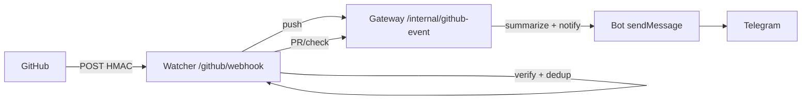

# GitHub Webhook Design — QROS Control Center (Stage 1)

## 1. Goal
Let `qros-github-watcher` receive GitHub events, verify they are authentic, deduplicate, and (Stage 2) forward minimal payloads to Gateway → Bot → Telegram. Not trading. Not AI. Remote project management only.

## 2. Endpoint
- **URL (public):** `POST https://<public-host>/github/webhook` → routes to `github-watcher:8082` (compose port `GITHUB_WEBHOOK_PORT`).
- **Local:** `POST http://localhost:8082/github/webhook`
- **Headers required:**
  - `X-Hub-Signature-256: sha256=<hmac-sha256(GITHUB_WEBHOOK_SECRET, raw_body)>`
  - `X-GitHub-Event: push | pull_request | check_suite | ...`
  - `X-GitHub-Delivery: <uuid>` (unique per delivery)
  - `Content-Type: application/json`

## 3. Verification
```python
# ControlCenter/GithubWatcher/src/webhook.py
import hmac, hashlib
def verify_signature(secret: str, payload: bytes, header: str|None) -> bool:
    if not secret or not header or not header.startswith("sha256="): return False
    expected = hmac.new(secret.encode(), payload, hashlib.sha256).hexdigest()
    return hmac.compare_digest(expected, header.removeprefix("sha256="))
```
- **Constant-time** compare prevents timing leaks.
- **401** on fail; **200** on success (GitHub treats non-2xx as failure and retries).

## 4. Subscribed Events (Stage 1 design, Stage 2 subscribe)
| Event | Why | Stage 2 action |
|---|---|---|
| `push` | branch update (arena/main) → AgentOS queues changed | Invalidate Gateway cache, optional Telegram notify `push to arena/... by @user` |
| `pull_request` (`opened`, `synchronize`, `closed`) | PR lifecycle | Gateway `github_read_file` PR diff → summarize for Telegram `/status` |
| `pull_request_review` | approvals | Same as PR |
| `check_suite` / `check_run` | CI (AgentOS CI) status | Forward pass/fail → Telegram |
| `workflow_run` | workflow conclusions | Same as checks |
| `issues` / `issue_comment` | optional task mirror | Future: map to TASK_QUEUE (read-only Stage 1) |

Registration: GitHub → repo → Settings → Webhooks → Add webhook → select individual events as above. Do not wildcard `*`.

## 5. Idempotency
- **Key:** `X-GitHub-Delivery` (UUID v4 per delivery). GitHub retries same delivery on 5xx; same UUID.
- **Stage 1:** log the delivery ID; no store.
- **Stage 2:** `SETNX redis:github:delivery:<uuid> 1 EX 86400` (24h). If exists, drop duplicate, reply `200 {"duplicate":true}`.

## 6. Payload Handling
- **Raw body is truth for HMAC** — read `await request.body()` before JSON parse.
- **Stage 1:** does not parse beyond logging `event`, `delivery`, `bytes`. No trust in body without HMAC.
- **Stage 2:** after HMAC, parse JSON, extract `repository.full_name == GITHUB_REPO` (reject if mismatch), then minimal forward:
  ```json
  { "event": "push", "delivery": "uuid", "repo": "masudbek001-droid/QuantResearchOS", "ref": "refs/heads/arena/...", "sender": "octocat" }
  ```
  Never forward `GITHUB_TOKEN` or secrets.

## 7. Routing (Stage 2)

- `push` → Gateway invalidates `AgentOS/**` cache (GitHub is source of truth).
- `pull_request`/`check_suite` → Gateway fetches PR/check via `GITHUB_TOKEN` → summarizes → Bot `sendMessage` to allowlisted users.

## 8. Reliability
- **Retries:** GitHub retries on non-2xx with exponential backoff (~1h window). Watcher must be idempotent and return `200` quickly (<2s) — offload heavy work to async queue (Stage 2).
- **Time:** Watcher logs `delivery` + `event` + `bytes`; Stage 2 adds Prometheus `github_webhook_total{event, status}`.

## 9. Security
- Secret rotation: `GITHUB_WEBHOOK_SECRET` in `.env` and GitHub webhook must match; rotate together.
- Token: Watcher holds `GITHUB_TOKEN` only if it needs to fetch commit status; prefer Gateway as sole holder (Stage 2 can keep Watcher token-less).
- TLS: prod Watcher behind TLS terminator (Traefik/Caddy/Cloudflare Tunnel); enforce `https` in `WATCHER_PUBLIC_URL`.

## 10. Local Test (offline)
```bash
python - <<'PY'
import hmac, hashlib, urllib.request, json, os
# read secret from .env
secret = [l.split("=",1)[1].strip() for l in open(".env") if l.startswith("GITHUB_WEBHOOK_SECRET=")][0]
body = json.dumps({"zen":"test"}).encode()
sig = "sha256=" + hmac.new(secret.encode(), body, hashlib.sha256).hexdigest()
req = urllib.request.Request("http://localhost:8082/github/webhook", data=body, headers={
  "X-Hub-Signature-256": sig, "X-GitHub-Event": "ping", "X-GitHub-Delivery": "stage1-test",
  "Content-Type": "application/json"
})
print(urllib.request.urlopen(req, timeout=5).read().decode())
PY
```

## 11. Stage 1 vs Stage 2
| Stage 1 | Stage 2 |
|---|---|
| Exposes `POST /github/webhook`, verifies HMAC, logs, returns `{"received":true,"forwarded":false}` | Verifies + dedups (Redis) + forwards to Gateway + async Telegram notify |
| No Redis, no GitHub API | Adds Redis, GitHub API reads, metrics |

See `ControlCenter/GithubWatcher/src/webhook.py` and `src/main.py`.
